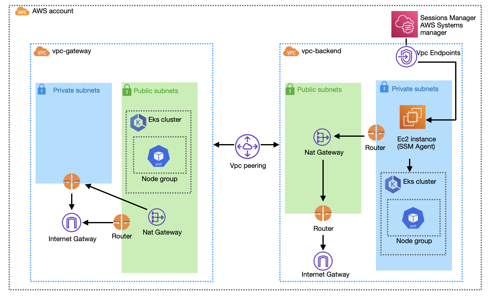

# 📘 Rapyd Sentinel: Split Architecture (PoC)

## Architecture Diagram



### ⚠️ Trade-offs & Unused Resources

- The **Gateway EKS node group was placed in public subnets** to simplify ALB provisioning and enable direct testing.
- A **NAT Gateway** was created in the Gateway VPC but remains unused — it was provisioned as part of the standard module setup.
- A better approach in production would be to:
  - Move the **Gateway EKS node group into private subnets**
  - Use the **existing bastion EC2 with SSM access** to apply manifest changes
  - Attach a **public-facing Application Load Balancer (ALB)** to expose the Gateway service securely


## 🚀 Project Overview

This project is a **proof-of-concept (PoC)** for the **Rapyd Sentinel architecture**, designed as per the technical challenge document.

It showcases:
- **Two isolated VPCs**:
  - `vpc-gateway` for public-facing proxy
  - `vpc-backend` for private backend services
- **Two Amazon EKS clusters**:
  - Each VPC contains two **private subnets**
  - In the gateway VPC, **EKS worker nodes are placed in public subnets** to support LoadBalancer (Classic Load balancer) provisioning
- **Secure networking via VPC Peering**
- **CI/CD with GitHub Actions**
- **Private manifest application via SSM-enabled EC2**

The project set up can be tested in http://acf49d36aa4b8437992e69ebde4f417c-1851791136.eu-central-1.elb.amazonaws.com/

---

## 📁 Project Structure

```bash
./environments/dev/
├── main.tf
├── backend.tf
├── terraform.tfstate
├── terraform.tfstate.backup

./modules/
├── backend/
├── ec2_ssm_bastion/
├── eks/
├── vpc/
└── vpc_peering/

./k8s/
├── backend/
│   ├── backend-deployment.yaml
│   ├── backend-service.yaml
│   └── network-policy.yaml
└── gateway/
    ├── gateway-deployment.yaml
    ├── gateway-service.yaml
    └── nginx-config.yaml
```

---

## How to Clone and Run the Project

### ✅ Prerequisites
- Terraform `>= 1.5.7`
- AWS CLI
- `kubectl`
- GitHub access to this repo

### Clone & Initialize
```bash
git clone https://github.com/akshay0819/sentinel-assignment-akshay
cd sentinel-assignment-akshay
cd environments/dev
terraform init
terraform validate
tflint
terraform plan
terraform apply
```

> This setup uses a `dev` environment but can easily be extended to `staging`, `prod`, etc.

> If starting from scratch, you may begin with **local backend** (`terraform init` without S3 config), and then switch to **remote S3 backend** as defined in `backend.tf`.

### 🛠️ What Gets Created
- Two VPCs (`vpc-gateway`, `vpc-backend`)
- Subnets:
  - Public + private subnets in `vpc-gateway`
  - Private-only subnets in `vpc-backend`
- NAT Gateways (1 per VPC)
- VPC Peering connection and routing
- EKS Clusters:
  - `eks-gateway`: deployed in public subnets
  - `eks-backend`: deployed in private subnets
- EC2 Instances:
  - One per VPC, SSM-enabled, no public IP
- Security Groups:
  - Tight inbound rules for backend
- VPC Interface Endpoints:
  - **Only SSM/EC2Messages/SSMMessages/STS** enabled

---

## Networking Configuration Between VPCs & Clusters

### Topology
- **Gateway VPC (10.10.0.0/16)**:
  - Public subnets: for EKS workers + Classic Load balancer
- **Backend VPC (10.20.0.0/16)**:
  - Private subnets only
  - No internet access

### 🔗 Communication
- VPC Peering (`pcx-095f3e64b3f958099`)
- Routing tables updated to enable cross-VPC traffic
- **SG rules**:
  - Allow ingress to backend only from Gateway EKS SG

---

## Proxy → Backend Connection

- The **NGINX proxy** in the `eks-gateway` cluster is exposed via an **Classic Load balancer**
- It forwards traffic to a **hardcoded backend URL**:
  ```
  http://acf49d36aa4b8437992e69ebde4f417c-1851791136.eu-central-1.elb.amazonaws.com/
  ```
- Returns: `Hello from backend`

#### Example Test:
```bash
curl http://acf49d36aa4b8437992e69ebde4f417c-1851791136.eu-central-1.elb.amazonaws.com/
# Output: Hello from backend
```

---

## 🔐 NetworkPolicy & Security Model

- Backend workloads are in **private subnets**
- Access controlled via **Security Groups**
- No Kubernetes `NetworkPolicy` implemented (planned enhancement)

---

## 🔒 Secure AWS Service Access

- VPC Interface Endpoints:
  - **SSM**, **EC2Messages**, **SSMMessages**, **STS**
- No S3 or Secrets Manager (future improvement)
- EC2/EKS can reach AWS APIs privately

---

## 🌍 DNS & Resolver Setup

> ❌ Not implemented in this PoC

- No Private Hosted Zones or Cloud Map used

---

## 🔄 CI/CD Pipeline

### 📁 GitHub Actions Workflow

- Triggered on push to `main`
- Steps:
  1. `terraform validate`, `tflint`, `terraform plan`, `terraform apply`
  2. `kubeval`, `kubectl apply --dry-run`
  3. Upload manifests to S3
  4. For `eks-backend`: deploy via SSM EC2
  5. For `eks-gateway`: deploy via GitHub runner

### 🔐 AWS Access for CI/CD
- GitHub Secrets:
  ```bash
  AWS_ACCESS_KEY_ID=<your_key>
  AWS_SECRET_ACCESS_KEY=<your_secret>
  ```

---

## 🚧 Trade-offs Due to 3-Day Limit

1. No NetworkPolicy
2. No Secrets Manager endpoint
3. No DNS resolver config
4. OIDC not used
5. Gateway EKS in public subnets (for speed of debugging and deployments) and use ALB instead of Classic LB for public access.
6. Gateway NAT created but unused (needs cleanup)
7. Limited CI/CD validations
---

## 💰 Cost Optimization Notes

- Used `t3.micro` for bastion
- Used `t3.small` for EKS nodes
- Future: use Spot instances

---

## 🔭 What We Would Do Next

- Add mTLS between proxy/backend
- Replace hardcoded IP with internal DNS
- Add CloudWatch + Prometheus
- Use Secrets Manager/Vault
- Clean up infra and enhance CI/CD
- Put Gateway EKS in private subnets and use the created gatway bastion with ssm for changes in pods and create a Apllication load balancer for public access. 
